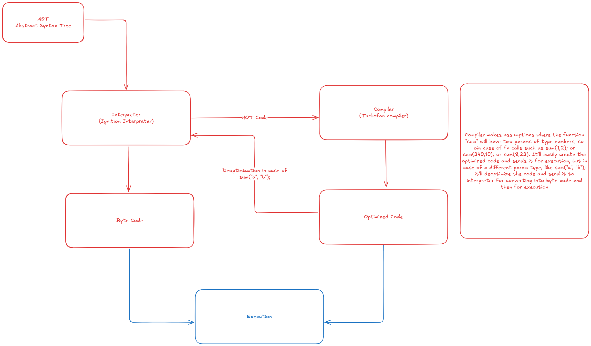

Namaste Node
Episode 8 - Deep dive into v8 JS Engine

1. Code Execution steps by v8 engine
    1. Parsing Stage
    ----------------------------------------------------------------------------------
    Stage A - Lexical Analysis - The code is broken down into tokens (it's also called tokenisation)
        var a = 10; token 1 = "var", token 2 = "a", token 3 = "=", token 4 = "10"
    Stage B - Syntax Analysis / Parsing / Syntax Parsing - the tokens are converted into Abstract Syntax Tree (AST)
    Refer - https://astexplorer.net/
    Code - 
        const a = 10;
        const b = 30;
        var name = 'john doe';

        function add(){
        return a + b;
        }

        add();
    AST -  JSON format
        {
        "type": "Program",
        "start": 0,
        "end": 93,
        "body": [
            {
            "type": "VariableDeclaration",
            "start": 0,
            "end": 13,
            "declarations": [
                {
                "type": "VariableDeclarator",
                "start": 6,
                "end": 12,
                "id": {
                    "type": "Identifier",
                    "start": 6,
                    "end": 7,
                    "name": "a"
                },
                "init": {
                    "type": "Literal",
                    "start": 10,
                    "end": 12,
                    "value": 10,
                    "raw": "10"
                }
                }
            ],
            "kind": "const"
            },
            {
            "type": "VariableDeclaration",
            "start": 14,
            "end": 27,
            "declarations": [
                {
                "type": "VariableDeclarator",
                "start": 20,
                "end": 26,
                "id": {
                    "type": "Identifier",
                    "start": 20,
                    "end": 21,
                    "name": "b"
                },
                "init": {
                    "type": "Literal",
                    "start": 24,
                    "end": 26,
                    "value": 30,
                    "raw": "30"
                }
                }
            ],
            "kind": "const"
            },
            {
            "type": "VariableDeclaration",
            "start": 28,
            "end": 50,
            "declarations": [
                {
                "type": "VariableDeclarator",
                "start": 32,
                "end": 49,
                "id": {
                    "type": "Identifier",
                    "start": 32,
                    "end": 36,
                    "name": "name"
                },
                "init": {
                    "type": "Literal",
                    "start": 39,
                    "end": 49,
                    "value": "john doe",
                    "raw": "'john doe'"
                }
                }
            ],
            "kind": "var"
            },
            {
            "type": "FunctionDeclaration",
            "start": 52,
            "end": 85,
            "id": {
                "type": "Identifier",
                "start": 61,
                "end": 64,
                "name": "add"
            },
            "expression": false,
            "generator": false,
            "async": false,
            "params": [],
            "body": {
                "type": "BlockStatement",
                "start": 66,
                "end": 85,
                "body": [
                {
                    "type": "ReturnStatement",
                    "start": 70,
                    "end": 83,
                    "argument": {
                    "type": "BinaryExpression",
                    "start": 77,
                    "end": 82,
                    "left": {
                        "type": "Identifier",
                        "start": 77,
                        "end": 78,
                        "name": "a"
                    },
                    "operator": "+",
                    "right": {
                        "type": "Identifier",
                        "start": 81,
                        "end": 82,
                        "name": "b"
                    }
                    }
                }
                ]
            }
            },
            {
            "type": "ExpressionStatement",
            "start": 87,
            "end": 93,
            "expression": {
                "type": "CallExpression",
                "start": 87,
                "end": 92,
                "callee": {
                "type": "Identifier",
                "start": 87,
                "end": 90,
                "name": "add"
                },
                "arguments": [],
                "optional": false
            }
            }
        ],
        "sourceType": "module"
        }

    Note: When the parser is not able to create a AST, it'll throw a 'Syntax Error'

    2. Interpretor
    ------------------------------------------------------------------------------------

    2 type of languages
    1. Interpreted languages -
        Line by line execution is done by the interpretor
        Fast intial execution
    2. Compiled languages
        The whole program code is converted into machine code and the machine code is executed by the compiler
        Initially heavy but executed fast
    
    What's a JS? An interpreted or compiled language?
    JS uses both interpreter and compiler, v8 uses both for executing JS code
    Compilation process in JS is called JIT (Just In Time) compilation

    Process (JIT compilation)
    1. AST is passed into to an interpretor
        in v8, the interpretor is called "Ignition Interpretor"
        Objective - Main objective of the interpretor is used to convert the AST code into byte code, and the byte code is executed
    2. In an scenario when Ignition interpretor identifies a function is called a lot in the AST, then the interpretor passes the function code to the compiler (Turbofan - v8) where it'll help to convert into a more efficient/optimized machine code to make the function execution faster. That particular code block is called 'HOT' code and it goes into execution
    3. Additional Info - Before Turbofan, Crankshaft compiler was used.

    Deoptimization
    1. Let's asumme there's a sum function, calcualtes sum of a and b
    2. When the sum function is called multiple times, iginition interpreter will pass the function to turbofan,
    3. Turbofan will assume the parameters are numbers, so sum(1,2), sum(4,30) will be run smoothly and turbofan will optimize the code
    4. But if fn call happens to be like sum("a", "b"), then turbofan compiler assumption is wrong, so the compiler will deoptimize the code and send it to the interpreter, and then the interpreter will convert into byte code and send to execution
    5. Learn more about, Inline Caching, Copy Elision

    For Ref: 

    Garbage Collection
    1. It's a parallel job done by the garbage collector in the process of optimization and de-optimization
    2. v8 Garbage Collectors - Orinico, Oilpan, Scavenger, Mark Compact (Each GC have a diffferent objective)
    3. Algorithm - Mark and Sweep Algorithm

Resources
1. Byte code gen - v8 github repo - https://github.com/v8/v8/blob/main/test/unittests/interpreter/bytecode_expectations/ForIn.golden
2. About Ignition and Turbofan - https://v8.dev/blog/launching-ignition-and-turbofan
3. Check out v8 docs