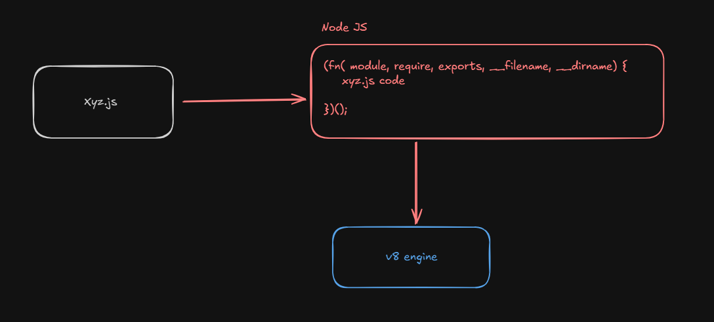

Namaste Node
Episode 3 - Let's write code

1. Node REPL
    REPL - Read Evaluate Print Loops
2. In your terminal, type in "node", it'll go into REPL mode where you can run node code
    
3. Global Object
    1. In browser, the global object is "window/this/self/frames", which is given but the browser
        1. window was used by normal JS devs
        2. this was used as a global object when the concept of this was introduced
        3. self was used as a global object but the web workers
        4. global was used as a globla object by the Node users
        5. In 2020, JS foundation came with a proposition to have a common global object and a single key to rep it, they came up with "globalThis", this was introduced in ES2020, and it's recognized in all JS run time environments.
    2. In Node JS, the global object is referred as "globalThis"
        1. globalThis is not part of v8 but it's one of the superpower provided by Node JS
        2. It can provide functions such as setTimeout, setInterval etc
